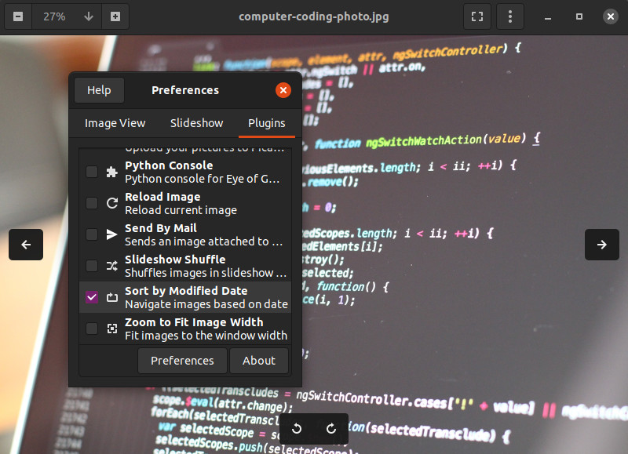

# GNOME Image Viewer (EOG) Plugin - Sort by Modified Date

Plug-in for Eye of GNOME to navigate images based on modified date.

## DOWNLOAD

[Click Here to Download the Latest Release](https://github.com/cybereality/eog-modified-date-plugin/releases/latest)

## INSTALLATION

Extract the downloaded source code files to your computer.

Find the folder `modified-date` and copy the entire folder into:

`$XDG_DATA_HOME/eog/plugins/`

If `$XDG_DATA_HOME` does not exist on your system, copy the folder to:

`$HOME/.local/share/eog/plugins/`

The `.../eog/plugins/` folder may not exist, so create it if needed.

## CONFIGURATION

* In Image Viewer, open the settings (3 dot icon).
* Choose Preferences in the menu that appears.
* Click the Plugins tab in the popup.
* Scroll down to "Sort by Modified Date"
* Click the checkbox to enable the plugin.
* Click Preferences on the bottom of the popup.
* Choose "Reverse Order" if desired.

## UNINSTALL

Delete the `modified-date` folder from `.../eog/plugins/`

## LICENSE

Copyright (C) 2021  Andres Hernandez <cybereality@gmail.com>

This program is free software: you can redistribute it and/or modify
it under the terms of the GNU General Public License as published by
the Free Software Foundation, either version 3 of the License, or
(at your option) any later version.

This program is distributed in the hope that it will be useful,
but WITHOUT ANY WARRANTY; without even the implied warranty of
MERCHANTABILITY or FITNESS FOR A PARTICULAR PURPOSE.  See the
GNU General Public License for more details.

You should have received a copy of the GNU General Public License
along with this program.  If not, see <https://www.gnu.org/licenses/>.
